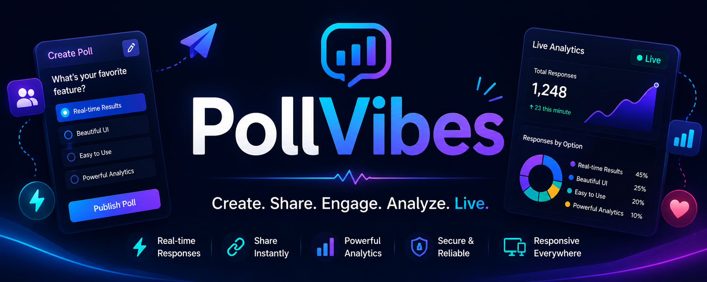

# 🚀 PollVibes

### Build realtime polls. Share instantly. Watch responses live.

A modern full-stack polling platform that enables creators, educators, communities, and teams to create interactive polls, collect realtime responses, and analyze audience engagement through live analytics.

<br/>

---

<p align="center">



</p>

---

## 🔗 Live Demo

> https://pollvibes.sulochanmahajan.com/


# Project Overview

PollVibes is a modern realtime polling platform designed for fast, interactive audience engagement.

Instead of static forms or delayed survey tools, PollVibes enables users to create dynamic polls, publish them instantly, share them using a public URL, and receive responses in realtime. Every interaction—from poll creation to audience participation—is designed to feel immediate, collaborative, and visually engaging.

The platform combines a premium frontend experience with a scalable backend architecture. Creators can manage multiple polls, monitor engagement, view analytics, and share polls publicly while respondents enjoy a clean interface that requires no unnecessary friction.

Whether you're conducting classroom quizzes, gathering community opinions, hosting live events, collecting customer feedback, or running internal team surveys, PollVibes provides a streamlined workflow from poll creation to actionable insights.

Unlike traditional survey applications that focus primarily on data collection, PollVibes emphasizes realtime interaction, making polling feel like a live experience rather than a static form.

---

# Why PollVibes?

## The Problem

Modern teams, educators, creators, and communities frequently rely on live polls to gather opinions and make decisions. However, many polling tools either lack realtime collaboration, provide limited analytics, or prioritize functionality over user experience.

PollVibes explores how a modern polling platform can combine realtime communication, secure authentication, intuitive workflows, and interactive analytics into a cohesive product.

---

## Our Solution

PollVibes reimagines polling as a realtime collaborative experience.

The platform enables creators to build interactive polls within minutes, publish them instantly, and distribute a public link that anyone can access. Participants can respond through a clean, distraction-free interface while the creator monitors activity through a live analytics dashboard.

By combining realtime communication, modern UI/UX principles, authentication, and responsive design, PollVibes creates an experience that feels closer to a live collaboration platform than a traditional survey application.

The result is a polling platform that is faster, more engaging, and significantly easier to use for both creators and participants.

---

# Features

PollVibes is built around the complete lifecycle of creating, sharing, participating in, and analyzing realtime polls.

## 🎯 Beautiful Poll Builder

Creating polls should never feel overwhelming.

The poll builder offers a clean multi-question interface where creators can define titles, descriptions, multiple-choice questions, response modes, expiration dates, and publishing settings without unnecessary complexity.

The experience focuses on speed while maintaining flexibility.

---

## 🌍 Public Poll Sharing

Every published poll receives its own unique public URL.

Instead of requiring users to create accounts or install applications, creators can simply copy the generated link and share it through messaging platforms, classrooms, communities, or social media.

Anyone with the link can participate instantly.

---

## ⚡ Live Audience Participation

PollVibes is designed for realtime engagement.

Participants submit responses through a distraction-free interface while creators can observe audience activity live. The platform is optimized to make polling feel interactive instead of passive.

---

## 📊 Live Analytics Dashboard

The analytics dashboard transforms raw responses into meaningful insights.

Creators can monitor response counts, participation trends, poll status, publishing information, and audience activity from a centralized dashboard designed for clarity and quick decision-making.

---

## 🔐 Flexible Response Modes

Different situations require different privacy models.

PollVibes supports both anonymous participation and authenticated responses, allowing creators to choose the most appropriate experience depending on the audience.

---

## 🚀 Instant Publishing Workflow

Polls can be created as drafts, edited freely, and published whenever they are ready.

This workflow prevents unfinished polls from being shared accidentally while allowing creators to prepare content ahead of time.

---

## 🎨 Premium User Experience

Every interface is carefully designed using modern SaaS design principles.

Glassmorphism, subtle gradients, smooth interactions, responsive layouts, premium typography, and accessible color systems create an experience that feels polished across desktop and mobile devices.

---

## 📱 Responsive Design

PollVibes is fully responsive across modern devices.

Whether users are creating polls on a desktop or answering them on a smartphone, the interface adapts seamlessly without sacrificing usability.

---

# 🏗️ System Architecture

PollVibes follows a modern client-server architecture with realtime communication using Socket.IO. The frontend is built as a Single Page Application using React, while the backend exposes REST APIs for CRUD operations and Socket.IO for live events. Authentication is delegated to Clerk, allowing secure identity management without storing credentials inside the application.

```text
                    ┌─────────────────────────────┐
                    │        End User             │
                    └─────────────┬───────────────┘
                                  │
                                  │ HTTPS
                                  ▼
                    ┌─────────────────────────────┐
                    │      React + Vite Client    │
                    │                             │
                    │ • Landing Page              │
                    │ • Dashboard                 │
                    │ • Poll Builder              │
                    │ • Analytics                 │
                    │ • Public Poll Page          │
                    └─────────────┬────────────── ┘
                     REST API     │     Socket.IO
                                  │
                 ┌────────────────┴────────────────┐
                 ▼                                 ▼
        ┌──────────────────┐              ┌──────────────────┐
        │ Express API      │              │ Socket.IO Server │
        │                  │              │                  │
        │ CRUD APIs        │              │ Live Responses   │
        │ Analytics        │              │ Live Presence    │
        │ Authentication   │              │ Broadcasting     │
        └─────────┬────────┘              └─────────┬────────┘
                  │
                  │
                  ▼
        ┌──────────────────────────────┐
        │         MongoDB Atlas        │
        │                              │
        │ Polls                        │
        │ Responses                    │
        │ Users                        │
        └──────────────────────────────┘

                  ▲
                  │
          Authentication
                  │
                  ▼
            Clerk Authentication
```

---

# 🔄 Application Flow

The application is divided into two primary experiences: the creator dashboard and the public voting experience.

### Poll Creation Flow

```text
Login
   ↓
Dashboard
   ↓
Create Poll
   ↓
Add Questions
   ↓
Publish Poll
   ↓
Share Public Link
```

---

### Audience Flow

```text
Receive Poll Link
        ↓
Open Public Poll
        ↓
Answer Questions
        ↓
Submit Response
        ↓
Success Page
```

---

### Analytics Flow

```text
User submits response
          ↓
REST API stores response
          ↓
MongoDB updates totals
          ↓
Socket.IO broadcasts event
          ↓
Dashboard receives live update
          ↓
Analytics refresh instantly
```

---

# ⚙️ Complete Tech Stack

## Frontend

- React 19
- TypeScript
- Vite
- React Router DOM
- Tailwind CSS v4
- Clerk React SDK
- Socket.IO Client
- Axios
- Lucide React

---

## Backend

- Node.js
- Express.js
- TypeScript
- Socket.IO
- MongoDB
- Mongoose

---

## Authentication

- Clerk
- JWT Session Verification

---

## Database

- MongoDB Atlas
- Mongoose ODM

---

## Deployment

Frontend

- Vercel

Backend

- Render

Database

- MongoDB Atlas

Authentication

- Clerk

---

## Development Tools

- VS Code
- Git
- GitHub
- Postman
- npm

---

# 📁 Folder Structure

```text
PollVibes
│
├── client/
│   ├── src/
│   │
│   ├── components/
│   │   ├── dashboard/
│   │   ├── landing/
│   │   ├── layout/
│   │   └── ui/
│   │
│   ├── pages/
│   │
│   ├── services/
│   │
│   ├── hooks/
│   │
│   ├── lib/
│   │
│   ├── types/
│   │
│   └── router.tsx
│
├── server/
│   ├── controllers/
│   ├── routes/
│   ├── middleware/
│   ├── services/
│   ├── sockets/
│   ├── models/
│   ├── utils/
│   └── index.ts
│
└── README.md
```

The frontend and backend are completely decoupled, communicating through REST APIs and Socket.IO events.

---

# 🗄️ Database Design

The application uses MongoDB with Mongoose.

## Poll

```text
Poll
│
├── title
├── description
├── creator
├── slug
├── responseMode
├── expiresAt
├── isPublished
├── isExpired
├── totalResponses
├── questions[]
│     ├── question
│     ├── required
│     └── options[]
└── timestamps
```

---

## Response

```text
Response
│
├── pollId
├── userId (optional)
├── isAnonymous
├── answers[]
│      ├── questionId
│      └── selectedOptionId
└── submittedAt
```

---

## Relationship

```text
User
   │
   │ 1 : N
   ▼
Poll
   │
   │ 1 : N
   ▼
Response
```

A single creator can own multiple polls, while each poll can contain many submitted responses.

---

# 🔐 Authentication Flow

PollVibes uses **Clerk** for authentication, allowing secure login without managing passwords or sessions manually.

```text
Visitor
    │
    ▼
Click Login
    │
    ▼
Clerk Modal
    │
    ▼
OAuth / Email Authentication
    │
    ▼
JWT Session Created
    │
    ▼
React App
    │
    ▼
Protected Routes
    │
    ▼
Backend verifies Clerk JWT
    │
    ▼
Authorized API Request
```

### Protected Resources

- Dashboard
- Poll Builder
- My Polls
- Analytics
- Response Management

The public poll page intentionally remains accessible without authentication (depending on the poll's configured response mode).

---

# ⚡ Realtime Communication

Realtime updates are powered using **Socket.IO**.

Instead of repeatedly polling the server, clients subscribe to Socket.IO events and receive updates instantly.

## Current Events

```text
poll:userResponding

Emitted when someone opens a poll and starts interacting.

────────────────────────────

poll:responseSubmitted

Emitted immediately after a successful vote.

────────────────────────────

Analytics Page

Listens for new responses and updates charts
without requiring a page refresh.
```

### Communication Flow

```text
Participant
      │
      ▼
Submit Response
      │
      ▼
REST API
      │
Store Response
      │
      ▼
Socket.IO Event
      │
      ▼
Connected Dashboard
      │
      ▼
Realtime Analytics Update
```

This hybrid REST + WebSocket architecture keeps data persistence reliable while providing an interactive realtime experience for creators.


# 🌐 API Design

The backend follows a RESTful architecture where every resource has a dedicated route and HTTP method. Protected endpoints require Clerk authentication, while public endpoints are accessible through unique poll slugs.

---

## Poll APIs

| Method | Endpoint | Description | Auth |
|---------|----------|-------------|------|
| POST | `/api/polls` | Create a new poll | ✅ |
| GET | `/api/polls/my` | Get all polls created by the current user | ✅ |
| GET | `/api/polls/:pollId` | Fetch poll details by ID | ✅ |
| PATCH | `/api/polls/:pollId/publish` | Publish an existing draft poll | ✅ |
| DELETE | `/api/polls/:pollId` | Delete a poll | ✅ |
| GET | `/api/polls/public/:slug` | Fetch a public poll using its shareable slug | ❌ |

---

## Response APIs

| Method | Endpoint | Description | Auth |
|---------|----------|-------------|------|
| POST | `/api/responses` | Submit poll response | Depends on Poll Mode |
| GET | `/api/responses/:pollId` | Fetch responses for analytics | ✅ |

---

## Example Request

### Create Poll

```http
POST /api/polls
Authorization: Bearer <clerk_token>
```

```json
{
  "title": "Favorite Frontend Framework",
  "description": "Community Survey",
  "responseMode": "anonymous",
  "expiresAt": "2026-12-31",
  "questions": [
    {
      "question": "Which framework do you prefer?",
      "required": true,
      "options": [
        { "text": "React" },
        { "text": "Vue" },
        { "text": "Angular" }
      ]
    }
  ]
}
```

---

# 🚀 Installation

Clone the repository.

```bash
git clone https://github.com/Sulochan36/PulseBoard
```

Move into the project directory.

```bash
cd pollvibes
```

Install frontend dependencies.

```bash
cd client
npm install
```

Install backend dependencies.

```bash
cd ../server
npm install
```

---

# 🔑 Environment Variables

Create a `.env` file inside the **server** directory.

```env
PORT=5000

MONGO_URI=your_mongodb_connection_string

CLERK_SECRET_KEY=your_clerk_secret_key

CLIENT_URL=http://localhost:5173
```

Create another `.env` file inside the **client** directory.

```env
VITE_CLERK_PUBLISHABLE_KEY=your_publishable_key

VITE_API_URL=http://localhost:5000/api

VITE_SOCKET_URL=http://localhost:5000
```

---

# ▶️ Running Locally

Start the backend server.

```bash
cd server
npm run dev
```

In another terminal, start the frontend.

```bash
cd client
npm run dev
```

Visit:

```
http://localhost:5173
```

---

# ☁️ Deployment

| Service | Platform |
|----------|----------|
| Frontend | Vercel |
| Backend | Render |
| Database | MongoDB Atlas |
| Authentication | Clerk |

The frontend communicates with the deployed backend through environment variables, while Clerk manages secure authentication and MongoDB Atlas stores persistent application data.

---

# 🚧 Challenges Faced

Developing PollVibes involved several engineering challenges beyond building user interfaces.

One of the biggest challenges was designing a realtime architecture that remained responsive without relying on continuous polling. Socket.IO was integrated to broadcast live events while REST APIs handled persistence, requiring careful coordination between the two communication layers.

Another challenge was authentication. Since Clerk manages user identity externally, backend APIs had to securely verify Clerk-issued tokens before granting access to protected resources.

Building nested poll structures was also non-trivial. Each poll contains multiple questions, and every question contains multiple options. Maintaining type safety across React forms, API requests, and MongoDB schemas required careful TypeScript modeling.

Finally, designing a premium SaaS-style interface required balancing aesthetics with usability. The dashboard, analytics pages, landing page, and poll builder were iteratively refined to provide a clean and modern experience.

---

# ⚡ Optimizations

Several optimizations were implemented throughout the project.

- Modular React component architecture for improved maintainability.
- Lazy page loading using React Router.
- Reusable UI components across dashboard and landing pages.
- Efficient MongoDB queries using indexed document lookups.
- Slug-based public routing for lightweight URL sharing.
- Socket events limited to relevant clients instead of broadcasting unnecessary updates.
- TypeScript used across the entire stack to reduce runtime errors.

---

# 🔒 Security Measures

Security was considered throughout the application architecture.

- Clerk handles authentication and session management.
- Protected API routes verify authenticated users before executing operations.
- Public poll access is controlled through unique slugs.
- Input validation is performed before persisting data.
- MongoDB queries are executed through Mongoose models to reduce injection risks.
- Sensitive credentials remain in environment variables and are never exposed to the client.

---

# 📈 Scalability Considerations

Although PollVibes is currently a portfolio project, the architecture was designed with future scalability in mind.

Potential improvements include:

- Redis adapter for scaling Socket.IO across multiple server instances.
- Rate limiting on public response endpoints.
- Caching frequently accessed public polls.
- Horizontal backend scaling behind a load balancer.

These enhancements would allow the platform to support significantly higher traffic while maintaining realtime performance.

---

# 🔮 Future Improvements

The current version focuses on the core realtime polling experience. Several possible enhancements for future versions.

- Live audience presence indicators.
- Rich analytics dashboard with advanced charts.
- Poll scheduling and automatic publishing.
- Multi-select and rating-based question types.
- CSV and PDF export for analytics.
- Email invitations and audience management.
- AI-assisted poll generation.
- Poll templates and reusable question banks.

---

# 📚 Lessons Learned

Building PollVibes provided valuable experience beyond implementing features.

The project reinforced the importance of separating concerns between frontend presentation, backend business logic, and realtime communication. Working with Clerk demonstrated how modern authentication providers simplify identity management while improving security.

Integrating Socket.IO highlighted the differences between request-response APIs and event-driven architectures, making it clear when each communication pattern is most appropriate.

Most importantly, the project emphasized that building a polished product involves much more than writing functional code. User experience, visual design, maintainable architecture, documentation, and deployment all contribute equally to delivering production-quality software.

# ⭐ Project Highlights

- Fully responsive SaaS-inspired UI
- Realtime communication using Socket.IO
- Secure authentication with Clerk
- Dynamic poll builder with nested question support
- Public shareable poll links
- Live analytics architecture
- Type-safe full-stack application using TypeScript
- Modern React + Express + MongoDB architecture